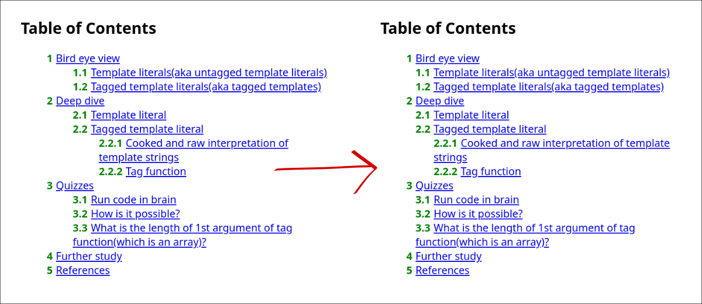

# tocbase-plugin-smart-indent

A [tocbase](https://github.com/ashutoshbw/tocbase) plugin for smartly adding indentation to ToC items. Here is a before after photo:



Above the offset is zero. If you want to them go a little more inward or outward you can do that with the `offset` option.

## Installing
### From CDN
In your HTML page's `<head>`, include the following alongside `tocbase` library:
```html
<script  src="https://unpkg.com/tocbase-plugin-smart-indent@1.0.0/dist/cdn.umd.min.js"></script>
```

This will result in a `smartIndent` variable containing a function.

### Using node and bundler
To install it run in your terminal:
```
npm i tocbase-plugin-smart-indent
```

Import it in your script like below if you are using ESM syntax:
```js
import smartIndent from "tocbase-plugin-smart-indent";
```

You can also use common js syntax:
```js
const smartIndent = require("tocbase-plugin-smart-indent");
```

Follow your bundler's instructions for generating the output file and then load it in your HTML page through script tag to use it.

## Usage
If used, it must be used as the first plugin:

```js
tocbase({
  plugins: [smartIndent()]
})
```

## Options
### `offset`
Type: A string representing CSS length value.<br>
Default: `"0"`

With `offset` you can move the ToC list items left(with a negative value) or right(with a positive value).
